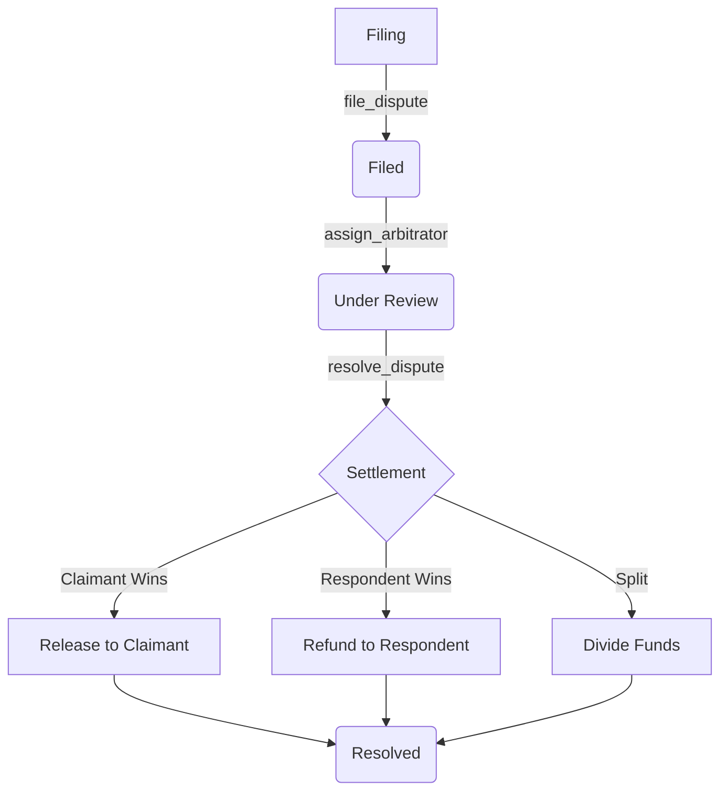

# PulsarTrack - Dispute Resolution (Soroban)

The **Dispute Resolution** smart contract provides an on-chain, decentralized mechanism to arbitrate and settle disputes between participants in the PulsarTrack ecosystem. It is primarily used to handle disagreements regarding campaign deliverables, funding releases, and service level agreements (SLAs).

## Table of Contents
- [Purpose](#purpose)
- [Public API](#public-api)
- [Storage Structure](#storage-structure)
- [Events](#events)
- [Error Handling](#error-handling)
- [Lifecycle Workflows](#lifecycle-workflows)
    - [Dispute Filing](#dispute-filing)
    - [Arbitration Assignment](#arbitration-assignment)
    - [Resolution and Settlement](#resolution-and-settlement)
- [DAO & Voting Integration](#dao--voting-integration)

---

## Purpose

The Dispute Resolution contract acts as a neutral third party that can:
1.  **Escrow Dispute Funds**: Lock the claimed amount directly in the contract.
2.  **Assign Qualified Arbitrators**: Allow administrators to assign authorized individuals or DAOs to review evidence.
3.  **Perform On-Chain Settlements**: Disburse funds based on an outcome (Claimant wins, Respondent wins, Split, or No Action).
4.  **Integrate with External Escrows**: Directly communicate with the `Escrow Vault` contract to settle large-scale campaign disputes.

---

## Public API

### Initialization

#### `initialize(admin: Address, token: Address, filing_fee: i128)`
Sets the contract configuration. Can only be called once.
- **admin**: Address with the authority to authorize and assign arbitrators.
- **token**: The native or Stellar token used for fees and claims.
- **filing_fee**: The amount required to file a dispute (used to discourage spam).

---

### Management

#### `authorize_arbitrator(admin: Address, arbitrator: Address)`
Adds an address to the approved arbitrator pool.
- **Restrictions**: Admin only (`require_auth()`).

#### `assign_arbitrator(admin: Address, dispute_id: u64, arbitrator: Address)`
Assigns an approved arbitrator to an active dispute.
- **Restrictions**: Admin only. The arbitrator must be previously authorized.
- **Side Effect**: Updates dispute status to `UnderReview`.

---

### Dispute Lifecycle

#### `file_dispute(claimant: Address, respondent: Address, campaign_id: u64, claim_amount: i128, description: String, evidence_hash: String) -> u64`
Files a new dispute and returns the `dispute_id`.
- **Fees**: Transfers the `filing_fee` from the claimant.
- **Escrow**: Transfers the `claim_amount` from the claimant to the contract until settlement.
- **Evidence**: Records a hash (typically IPFS) of the supporting evidence.

#### `resolve_dispute(arbitrator: Address, dispute_id: u64, outcome: DisputeOutcome, notes: String)`
Pushes the final resolution for a dispute.
- **Restrictions**: Only the assigned arbitrator can call this.
- **Outcomes**:
    - `Claimant`: Full amount released to the claimant.
    - `Respondent`: Full amount refunded to the respondent.
    - `Split`: Amount divided (50/50) between parties.
    - `NoAction`: Dispute dismissed.
- **Fee Refund**: If a filing fee was paid, it is proportionally returned based on the outcome (e.g., if the claimant wins, they get their fee back).

#### `get_dispute(dispute_id: u64) -> Option<Dispute>`
Retrieves the full record of a dispute.

---

### External Integration

#### `set_escrow_contract(admin: Address, escrow_contract: Address)`
Configures the address of the linked `Escrow Vault` contract.

#### `link_dispute_escrow(admin: Address, dispute_id: u64, escrow_id: u64)`
Links a specific dispute to an external escrow ID.

---

## Storage Structure

The contract uses a hybrid storage model to optimize costs and performance:

| Key Type | Storage | Values |
| :--- | :--- | :--- |
| `Admin` | Instance | Primary contract administrator. |
| `TokenAddress` | Instance | The token used for the dispute. |
| `FilingFee` | Instance | Configurable fee for filing disputes. |
| `DisputeCounter` | Instance | Global counter for generating `dispute_id`. |
| `Dispute(u64)` | Persistent | The `Dispute` struct containing metadata and state. |
| `ArbitratorApproved(Address)` | Persistent | Boolean flag indicating arbitrator authorization status. |
| `DisputeEscrow(u64)` | Persistent | Mapping from `dispute_id` to external `escrow_id`. |

---

## Events

The contract emits the following events for indexing and off-chain monitoring:

1.  **Dispute Filed**: `(symbol_short!("dispute"), symbol_short!("filed"))`
    - Data: `(dispute_id: u64, claimant: Address)`
2.  **Dispute Resolved**: `(symbol_short!("dispute"), symbol_short!("resolved"))`
    - Data: `dispute_id: u64`

---

## Error Handling

Common reasons for transaction failure (`panic!` messages):
- **"unauthorized"**: The caller lacks the required permissions.
- **"already initialized"**: Attempting to call `initialize` more than once.
- **"dispute not found"**: The requested `dispute_id` does not exist or has expired.
- **"arbitrator not authorized"**: The assigned address is not in the approved pool.
- **"already resolved"**: Attempting to resolve a dispute that is already in a final state.

---

## Lifecycle Workflows

### Dispute Filing
1.  Claimant submits `file_dispute`.
2.  Contract verifies balance and collects `filing_fee`.
3.  Contract transfers `claim_amount` into its own address for escrow.
4.  Dispute is assigned a unique ID and set to `Filed` status.

### Arbitration Assignment
1.  Admin identifies a dispute and selects an authorized arbitrator.
2.  Admin calls `assign_arbitrator`.
3.  The contract validates that the arbitrator is approved.
4.  The arbitrator address is stored in the dispute record, and status moves to `UnderReview`.

### Resolution and Settlement
1.  The arbitrator reviews the `evidence_hash` off-chain.
2.  The arbitrator calls `resolve_dispute` on-chain.
3.  The contract verifies the arbitrator's identity via `require_auth()`.
4.  The contract calculates disbursements and fee returns.
5.  Funds are transferred from the contract to the respective parties (or settled via the linked `Escrow Vault`).

---

## DAO & Voting Integration

While the contract identifies the arbitrator as an `Address`, this address can point to a **Governance DAO** contract. 

1.  **Delegation**: By authorizing a DAO contract as an arbitrator, PulsarTrack enables community-governed dispute resolution.
2.  **Voting**: When a dispute is assigned to a DAO, a proposal is created within the DAO for members to vote on the outcome.
3.  **Execution**: Once the DAO vote concludes, the DAO contract invokes `resolve_dispute` with the result determined by the majority vote.

This pattern allows PulsarTrack to scale arbitration from a single trusted admin to a decentralized network of experts or community members.
